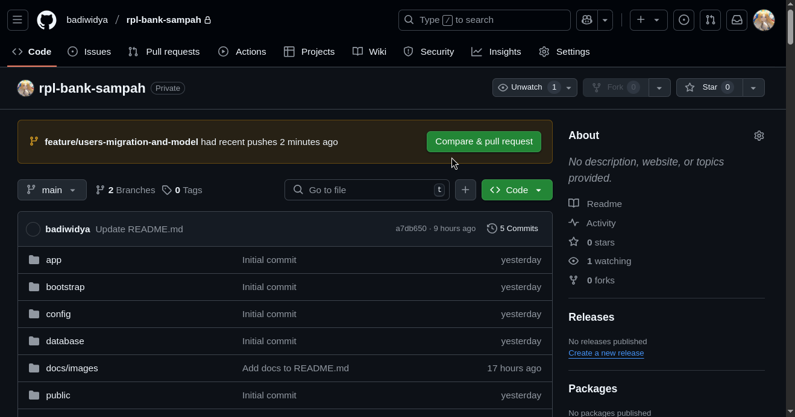
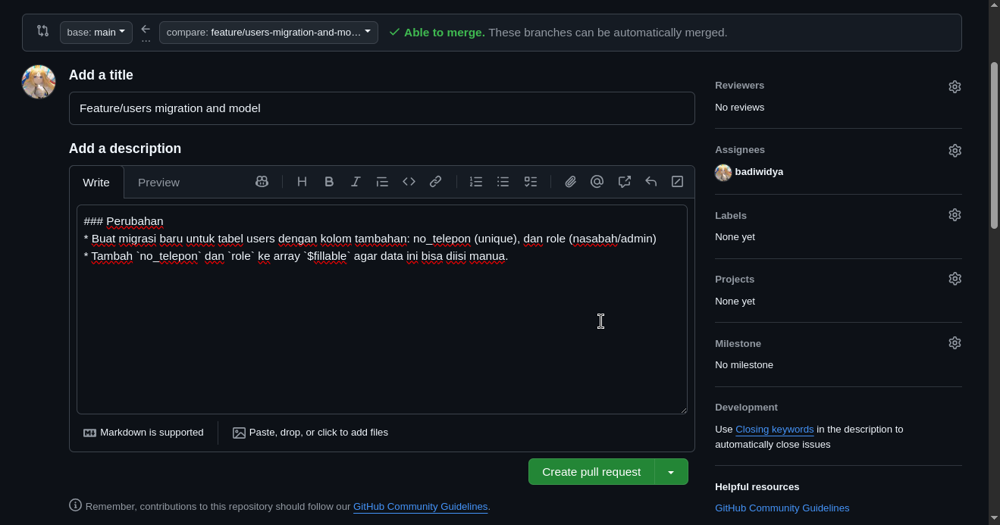
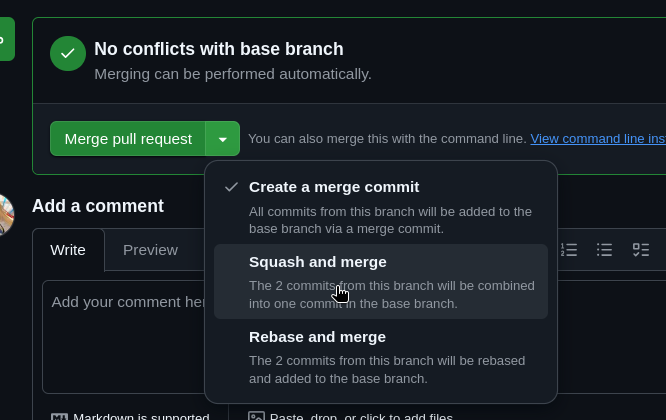
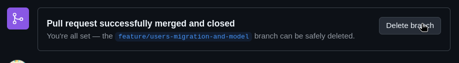

# Git Workflow

Dokumen ini berisi panduan biar kolaborasi kita rapi dan ngga ada kode yang bentrok.

## Struktur Project

```
├── data/
├── docs/
├── ds/
├── fs/
├── ml/
├── GIT_WORKFLOW.md
└── README.md
```

Direktori dipisah berdasarkan role, untuk file `*.csv` bisa ditaruh di `data/`.

## Workflow Overview

1. **Sync Main**: Ambil update terbaru di branch main.
2. **Buat Branch Baru**: Buat branch baru untuk penambahan fitur atau perubahan yang mau dikerjain (misal: `fs/tambah-endpoint-user`).
3. **Work & Commit**: Ngoding terus simpen (commit).
4. **Final Sync**: Pull update terbaru dari main ke branch kerja (jaga-jaga kalau ada yang PR yang baru dimerge).
5. **Push**: Push branch kerja ke Github.
6. **Pull Request**: Buat Pull Request di Github.
7. **Review & Merge**: Diskui kode (kalo perlu), baru merge ke main lewat Github.
8. **Cleanup**: Hapus branch yang udah ngga dipake biar ngga nyampah.
8. **Repeat**: Mulai dari langkah awal untuk fitur/perubahan selanjutnya.

## Penjelasan

### Sync Main

Sebelum kalian mulai bikin branch, pastiin ambil update terbaru dari remote (repository Github).
Takutnya ada perubahan baru.

```bash
# Pindah branch ke main
git switch main
# Tarik update terbaru dari Github
git pull origin main
```

### Buat Branch Baru

Pastiin selalu buat branch baru untuk setiap perubahan atau penambahan fitur.

```bash
git switch -c nama-branch
```

> 💡 **Tip:** Buat nama branch yang deskriptif. Misalkan `fs/tambah-endpoint-autentikasi` (`fs` itu fullstack, `tambah-endpoint-autentikasi` deskripsi perubahan atau penambahan fitur yang mau dilakukan).

### Work & Commit

Di tahap ini baru kita ngoding atau ngelakuin perubahan yang kita mau. Simpan (commit) progres secara
berkala.

```bash
# Tambah semua perubahan yang terjadi di direktori saat ini ke staging area
git add .
# atau
git add path/ke/file/spesifik
# Commit perubahan
git commit -m "<pesan commit>"
```

### Final Sync

Sebelum push, **selalu** pastiin tarik perubahan terbaru dari main.

```bash
git pull origin main
```

### Push

Setelah itu baru push branch ke remote (Github).

```bash
git push origin fs/tambah-endpoint-autentikasi # ini contoh nama branch yang dipake tadi
```

### Pull Request

Selanjutnya kita bikin **pull request** di Github.

1. Teken tombol `Compare & pull request`

<p align="center"></p>

2. Buat PR

<p align="center"></p>

### Review & Merge

Minta tolong temen review code (kalo perlu), diskusi code (kalau perlu), merge.

<p align="center"></p>

Pake **squash & merge** aja biar history nya rapi. Bebas sih.

### Cleanup

Hapus branch yang udah dimerge biar ngga jadi sampah.

<p align="center"></p>

Selanjutnya ke lokal repo lagi dan tarik perubahan baru dari main setelah merge, sekalian hapus
branch di lokal.

```bash
# Pindah ke branch main
git switch main
# Tarik perubahan baru (yang baru aja dimerge)
git pull origin main
# Hapus branch lama di lokal
git branch -D fs/tambah-endpoint-autentikasi
```

### Repeat

Ulangi dari awal.
