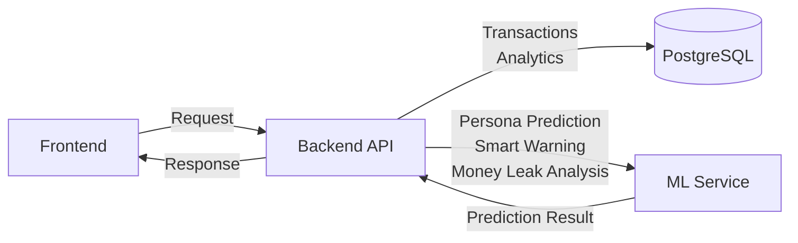

# SpendBehavior Analyzer (BUDU)

**BUDU (Butuh Duit)** adalah aplikasi web yang membantu pengguna memahami pola pengeluaran dan kebiasaan finansial mereka melalui analisis transaksi, spending persona, smart warning, dan deteksi kebocoran pengeluaran (_money leak detection_).

Project ini dibangun sebagai aplikasi full-stack yang terdiri dari frontend React, backend Express.js, PostgreSQL, dan layanan Machine Learning berbasis FastAPI.

## Fitur Utama

- Analisis perilaku pengeluaran
- Spending Persona Prediction
- Smart Warning
- Money Leak Detection

## Arsitektur Sistem



## Tech Stack

### Frontend

- React
- TypeScript
- Vite
- Tailwind CSS
- React Router

### Backend

- Node.js
- TypeScript
- Express.js
- PostgreSQL
- Drizzle ORM
- JWT Authentication

### Machine Learning Service

- Python
- FastAPI
- TensorFlow / Keras
- Scikit-Learn
- Pandas
- NumPy

## Prasyarat

Sebelum menjalankan project, pastikan salah satu setup berikut telah tersedia.

### Opsi 1 (Direkomendasikan)

Menjalankan seluruh aplikasi menggunakan Docker.

- Docker
- Docker Compose

### Opsi 2 (Tanpa Docker)

Menjalankan setiap service secara manual.

- Node.js >=24
- Python 3.12
- PostgreSQL >=17

## Setup Environment

Salin file environment:

```bash
cp .env.example .env
```

Sesuaikan nilai pada file `.env` sesuai kebutuhan.

Variabel yang wajib diperiksa:

```env
APP_URL=
DATABASE_URL=
FRONTEND_URL=
DATABASE_URL=
JWT_SECRET=
ML_SERVICE_URL=
VITE_API_URL=
```

## Menjalankan Dengan Docker (Direkomendasikan)

### 1. Clone Repository

```bash
git clone https://github.com/cubemie/DBS_Capstone_SpendBehavior-Analyzer.git
cd DBS_Capstone_SpendBehavior-Analyzer
```

### 2. Buat File Environment

```bash
cp .env.example .env
```

### 3. Jalankan Seluruh Service

```bash
docker compose up -d --build
```

### 4. Jalankan Migrasi Database

```bash
docker compose --profile migrate run --rm backend-migrate
```

### 5. Akses Aplikasi

| Service     | URL                   |
| ----------- | --------------------- |
| Frontend    | http://localhost:8080 |
| Backend API | http://localhost:3000 |
| ML Service  | http://localhost:8000 |

## Menjalankan Secara Lokal (Tanpa Docker)

## 1. Clone Repository

```bash
git clone https://github.com/cubemie/DBS_Capstone_SpendBehavior-Analyzer.git
cd DBS_Capstone_SpendBehavior-Analyzer
```

## 2. Buat File Environment

```bash
cp .env.example .env
```

## 3. Siapkan Database PostgreSQL

Buat database baru sesuai konfigurasi pada `.env`.

Contoh:

```sql
CREATE DATABASE budu;
```

## 4. Jalankan Backend

```bash
cd fs/backend

npm install

npm run drizzle:migrate

npm run dev
```

Backend akan berjalan di:

```text
http://localhost:3000
```

## 5. Jalankan ML Service

Buka terminal baru:

```bash
cd ml

python -m venv .venv

source .venv/bin/activate # atau '.\.venv\Scripts\Activate.ps1'

pip install -r requirements.txt

uvicorn app.main:app --reload # atau 'make run' apabila Make terinstal
```

ML Service akan berjalan di:

```text
http://localhost:8000
```

## 6. Jalankan Frontend

Buka terminal baru:

```bash
cd fs/frontend

npm install

npm run dev
```

Frontend akan berjalan di:

```text
http://localhost:5173
```

## Struktur Repository

```text
.
├── fs/
│   ├── backend/
│   └── frontend/
├── ml/
├── ds/
├── docker-compose.yml
├── .env.example
└── README.md
```

## Dokumentasi Tambahan

Dokumentasi teknis untuk masing-masing modul tersedia pada:

- `fs/backend/README.md`
- `fs/frontend/README.md`
- `ml/README.md`

## Dokumentasi Web BUDU
#


#


#


#


#


#


#

